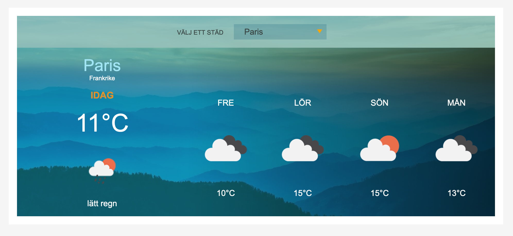

# Javascript Weather app

A little weather app made using MVC Javascript and the [Open Weather API](https://openweathermap.org).

# Purpose

The app was made as my solution to my JavaScript assignment.

The assignment required the following criteria:

- cities are saved in a separate JSON file
- dropdown menu displaying the various cities
- must be able to display 5 days of weather
- weather icons to match cities' respective weather
- temperature (time point: 12.00 o'clock)
- use of the Open Weather API

